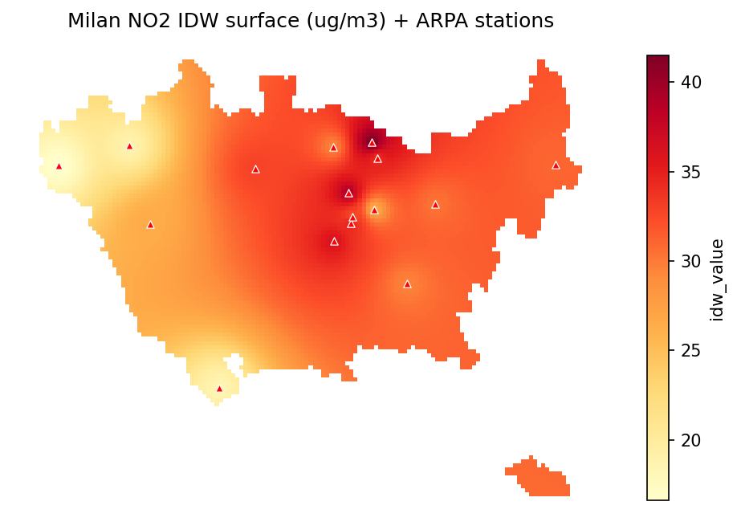

# geoexposure

A small Python toolkit for **point-to-population environmental exposure**.
It implements one complete geospatial processing chain:

> measurement points → regular grid → IDW interpolation →
> population-weighted exposure → equity / inequality summary

All spatial data uses **EPSG:32632** (UTM zone 32N), with Milan air-quality
(NO₂) data as the worked example.

## Installation

Developed and tested on **Python 3.11**; supports Python ≥ 3.11.

```bash
git clone https://github.com/GuojialeGeographer/geoexposure.git
cd geoexposure

# Create an environment (use whichever tool you have):
python -m venv .venv && source .venv/bin/activate
#   Windows:  python -m venv .venv && .venv\Scripts\activate
#   or conda: conda create -n geoexposure python=3.11 -y && conda activate geoexposure

pip install -e ".[test]"            # runtime + test dependencies, one command

pytest                              # verify the install
python examples/basic_workflow.py   # run the end-to-end example
```

Pinned dependencies (also listed in `requirements.txt`): geopandas 1.1.3,
shapely 2.1.2, pyproj 3.7.2, numpy ≥ 1.26, pandas ≥ 2.0.

## Usage

```python
from geoexposure import (
    load_sample_data, create_regular_grid, idw_interpolation,
    population_weighted_exposure, area_weighted_mean, exposure_bias,
    exposure_inequality_summary,
)

data = load_sample_data()                         # boundary, stations, population_grid
grid = create_regular_grid(data["boundary"], cell_size=500)
grid = idw_interpolation(data["stations"], grid, value_col="no2")
# ... join population onto the grid ...
pwe  = population_weighted_exposure(grid, "idw_value", "population")
mean = area_weighted_mean(grid, "idw_value")
bias = exposure_bias(pwe, mean)
```

See [`examples/basic_workflow.py`](examples/basic_workflow.py) for the full chain.

## API

| Module | Function | Purpose |
|---|---|---|
| `grid` | `create_regular_grid` | square grid over a boundary |
| `grid` | `create_hexagonal_grid` | isotropic hexagonal grid alternative |
| `interpolation` | `idw_interpolation` | IDW from points to grid (`idw_value`) |
| `exposure` | `population_weighted_exposure` | PWE scalar |
| `exposure` | `area_weighted_mean` | plain area mean |
| `exposure` | `exposure_bias` | % bias PWE vs. mean |
| `equity` | `exposure_inequality_summary` | high/low exposure groups |
| `io` | `load_sample_data` | bundled Milan datasets |
| `plotting` | `plot_choropleth` | choropleth map (+ optional point overlay) |

**Terminology:** a grid cell carries a *concentration* (`idw_value`); only the
population-aggregated scalar is called an *exposure*.

## Data

The `data/` folder ships three GeoJSON files in EPSG:32632, all using real
Milan coordinates:

| File | Contents | Key column |
|---|---|---|
| `boundary.geojson` | study-area polygon | – |
| `stations.geojson` | NO₂ monitoring stations | `no2` |
| `population_grid.geojson` | 1 km population cells | `population` |

The three files are **real Milan data** (EPSG:32632): an ISTAT administrative
boundary, ARPA Lombardia NO₂ monitoring stations (annual means), and the ISTAT
2021 census population on a 500 m grid. See [`data/README.md`](data/README.md)
for full provenance. To use different data, replace the three files keeping the
same filenames, key columns and CRS.

## Outputs

Running `python examples/basic_workflow.py` writes three kinds of output to
`outputs/`:

- **data:** `grid_no2_exposure.geojson` — the analysis grid enriched with
  `idw_value` and `population`
- **table:** `summary.csv` — PWE, area mean, exposure bias and the equity summary
- **charts:** `map_no2_idw.png` (NO₂ IDW surface + stations) and
  `map_exposure_groups.png` (low / mid / high exposure cells)



A narrated walkthrough with inline maps and a square-vs-hexagonal grid
comparison is in [`notebooks/geoexposure_demo.ipynb`](notebooks/geoexposure_demo.ipynb)
(renders on GitHub; to re-run it: `pip install -e ".[notebook]"` then
`jupyter lab`).

## Testing

```bash
pip install -e ".[test]"
pytest
```

## Contributing

Contributions are welcome. Please keep the five-module layout
(`grid` / `interpolation` / `exposure` / `equity` / `io`), the fixed function
signatures, and EPSG:32632 throughout. Add a unit test for any new behaviour.

## License

MIT — see [LICENSE](LICENSE).
